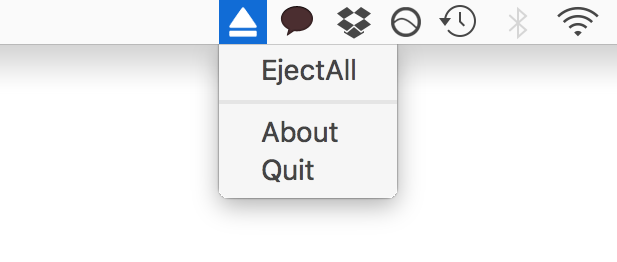

# Eject All App

#### A simple statusbar app to quickly eject all external disks on your Mac in two clicks

\
Menu interface of this simple app

\
Notification with sound when eject is successful

#### File Structure
* `./EjectAll` (Drag and drop Mac Application)
* `./docs` (documents)
* `./src` (Xcode Swift project files)